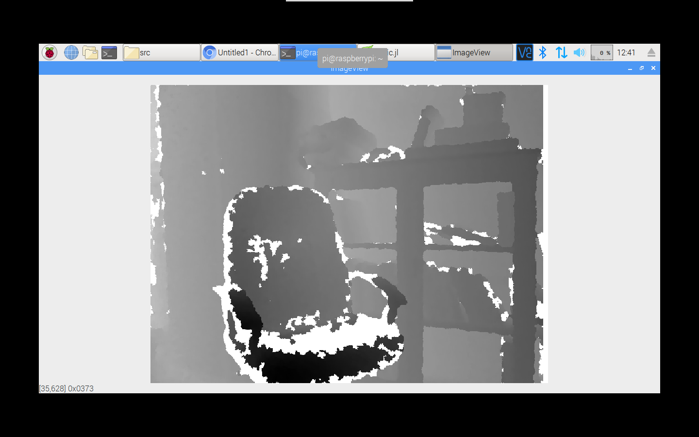

# Video4Linux

The aim of this package is to provide lower level access to the v4l2 driver for raw data manipulation. As much as possible should be implemented in Julia.
This is work in progress and any suggestions and contributions are very welcome.  


[](https://travis-ci.org/Affie/Video4Linux.jl)

[](http://codecov.io/github/Affie/Video4Linux.jl?branch=master)

## Installation
The package is currently unregistered and can be installed and build with: (replace YOURREPONAME with your github fork name)
```julia
Pkg.clone("https://github.com/YOURREPONAME/Video4Linux.jl.git")
Pkg.build("Video4Linux")
```

## Device Setup
No automatic setup is currently performed but there are utilities to make this easy: 
qv4l2 (install with: `sudo apt-get install qv4l2`)
qv4l2 provides a gui of the ioctl of the device. Settings such as frame size and capture format can easily be changed.

## Kinect Example
Currently the only camera tested is the Kenect using the v4l2 kernel driver.  
This example was run on an raspberry pi 3 with Rasbian and julia 0.6.   
The kenect driver can be set to depth mode with:  
`sudo rmmod gspca_kinect`  
`sudo modprobe gspca_kinect depth_mode = 1`  

```julia
using Video4Linux
using ImageView
using Colors, ColorTypes

# Warning! no memory and device protection is implemented yet, therefore doing things out of order will cause julia to crash!
## set io method to read() for the Kenect depth image. NOTE: if your device does not support read try using Video4Linux.IO_METHOD_MMAP
set_io_method(Video4Linux.IO_METHOD_READ)
## open device
fid = open_device("/dev/video0")
## init_device(fd, force_format);
init_device(fid)
## start_capturing(fd);
start_capturing(fid)
## mainloop(fd, frame_count);
mainloop( fid, 1 )
## copy_buffer_bytes, copy the image buffer bytes to uint8 vector, the lenght will depend on the pixel format
imbuff = copy_buffer_bytes(640*480*2)
## stop_capturing(fd);
stop_capturing(fid)
## uninit_device();
uninit_device(fid)
## close device
close_device(fid)
## kenect 1 depth image, set kernel to depth with:
depthvec = convertY10BtoU16(imbuff[1:384000])
depthim = reshape(depthvec,(640,480))'
imshow(depthim)
```

